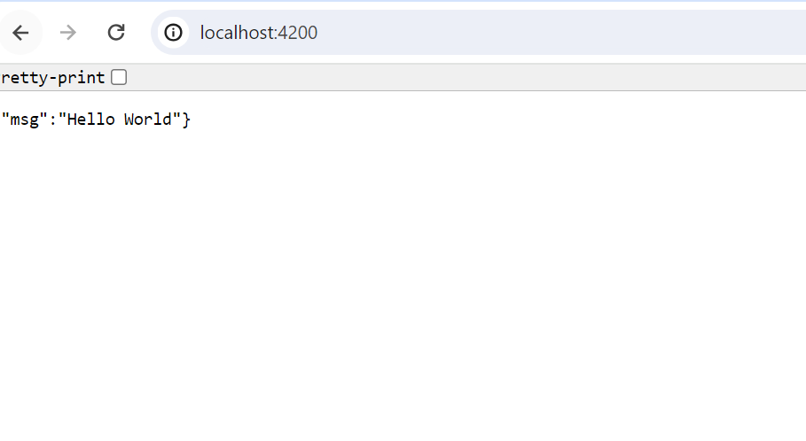
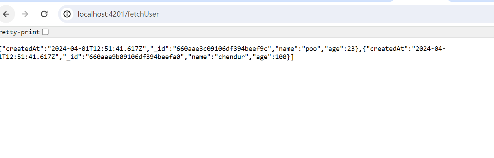
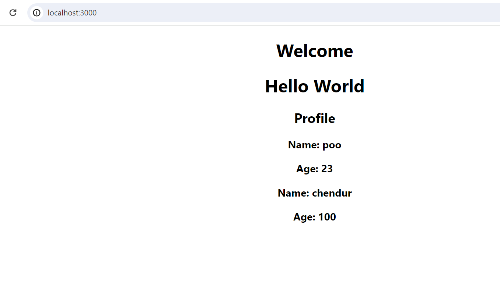

# SampleMERNwithMicroservices

Step 1: Set Up the AWS Environment

1. Set Up AWS CLI and Boto3:
   - Install AWS CLI and configure it with AWS credentials.
    
   ```
   aws configure
   ```
    - Install Boto3 for Python and configure it.

   ```
   pip install boto3
   ```
   
Step 2: Prepare the MERN Application

1. Containerize the MERN Application:

   - Ensure the MERN application is containerized using Docker. Create a Dockerfile for each component (frontend and backend).

# Backend HelloService
Checkout to the code and create .env file then update PORT value there.
```
PORT= 4200
```
Created the Docker file which expose to th eport 4200, build and run docker container in yout local, you will get the output as mentioned below.


# Backend Profile service 
Checkout to the code and create .env file then update PORT value and mongo url.
```
PORT=4201
MONGO_URL= 'your mongodb url ' 
```
Created the Docker file which expose to th eport 4201, build and run docker container in yout local, you will get the output as mentioned below.

Add some data in your database.


# Frontend service 

Checkout to frontend application, go tto Home.js file and update the backend hello and profile service url
```
cd src/components/Home.js

# update both hello and profile service with respective port numbers
 # Hello service 
http://localhost:4200/     
 # Profile service 
http://localhost:4201/fetchUser             
```
Created the Docker file which expose to th eport 3000, build and run docker container in yout local, you will get the output as mentioned below.


# Docker compose
Created docker compose file to trst all the dockerfile is up and running fin ewith perfect sink.


2. Push Docker Images to Amazon ECR:

   - Build Docker images for the frontend and backend.

   - Create an Amazon ECR repository for each image.

   - Push the Docker images to their respective ECR repositories.

Build and pushed the image to docker hub using the command mentioned below, repeated the same step for all the 3 images.
```
docker build -t frontend_service:v1.0 .
docker tag frontend_service:v1.0 flowerking21/micro_frontendservice:latest
docker push flowerking21/micro_frontendservice:latest
```
Login to AWS console, create a ECR repository and push the image to the repository.
```
#Create a ECR repository 
aws ecr create-repository --repository-name micro_frontendservice --region ap-south-1
# Login to AWS
aws ecr get-login-password --region ap-south-1 | docker login --username AWS --password-stdin 515210271098.dkr.ecr.ap-south-1.amazonaws.com
# tag your image with the ECR repository image
docker tag flowerking21/micro_frontendservice:latest 515210271098.dkr.ecr.ap-south-1.amazonaws.com/micro_frontendservice:latest
# push to ECR repository
docker push 515210271098.dkr.ecr.ap-south-1.amazonaws.com/micro_frontendservice:latest
```
Step 3: Version Control

1. Use AWS CodeCommit:

   - Create a CodeCommit repository.

   - Push the MERN application source code to the CodeCommit repository.